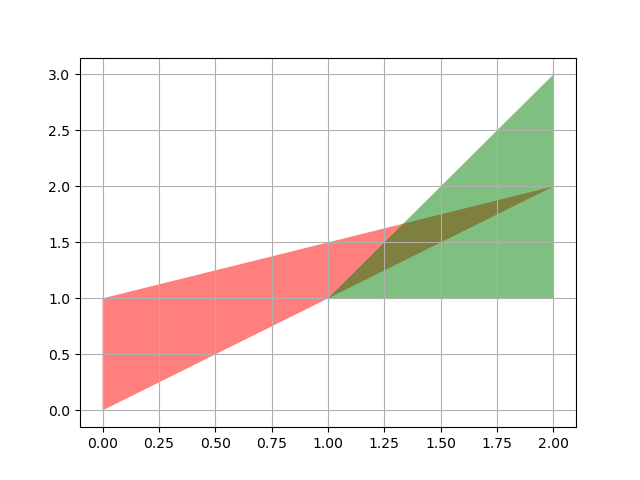

# 聚合
空间数据处理领域对聚合操作有广泛的需求。Arctern 暂时仅支持两种聚合方法，即 [`unary_union`](../../api_reference/standalone_api/api/arctern.GeoSeries.unary_union.html) 和 [`envelope_aggr`](../../api_reference/standalone_api/api/arctern.GeoSeries.envelope_aggr.html)。这两个聚合函数的功能如下：
 - **unary_union:** 返回一个代表一组几何体的并集的几何体。
 - **envelope_aggr:** 计算包含一组几何体的最小矩形边界范围，且该矩形的边与坐标轴平行。

本文档将介绍如何使用 Arctern GeoSeries 的聚合方法。

## 生成测试数据

创建一个 GeoSeries 对象，其中包含两个多边形（POLYGON）：

```python
>>> from arctern import GeoSeries
>>> polygon_s = GeoSeries(["POLYGON ((0 0,0 1,1.5 2,0 0))", "POLYGON ((1 1,2 1,2 3,1 1))"])
```
`polygon_s` 中的两个几何体如下图所示：

    

## 测试

### 获取一组几何体的并集

选取 `polygon_s` 的所有元素，并使用 [`unary_union`](../../api_reference/standalone_api/api/arctern.GeoSeries.unary_union.html) 方法得出它们的并集：

```python
>>> polygon_s[[0,1]].unary_union()
0    MULTIPOLYGON (((0 0,0 1,1 1,0 0)),((1 1,2 3,2 1,1 1)))
dtype: GeoDtype
```
聚合结果如下图所示：


### 获取一组几何体的最小矩形边界

选取 `polygon_s` 的所有元素，并使用 [`envelope_aggr`](../../api_reference/standalone_api/api/arctern.GeoSeries.envelope_aggr.html) 方法得出它们的最小矩形边界：

```python
>>> geos[[0,2]].envelope_aggr()
0    POLYGON ((0 0,0 3,2 3,2 0,0 0))
dtype: GeoDtype
```
聚合结果如下图所示：

