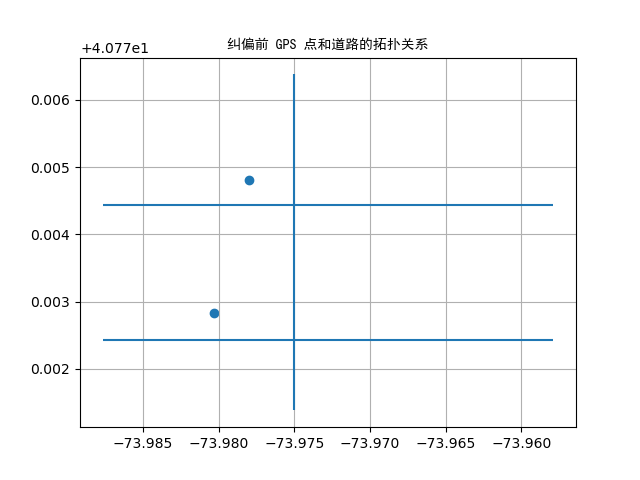
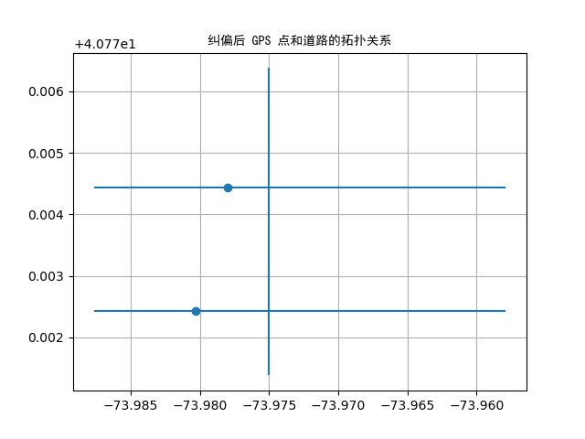

# 地图匹配

Arctern 支持对 GPS 数据和路网进行关系分析，比如判断 GPS 点附近是否存在道路、搜索距离 GPS 点最近的道路，以及获得距离 GPS 点最近且在道路上的映射点。

## 生成数据集

首先，生成数据集以演示如何使用 Arctern 分析 GPS 数据和路网的关系。

`roads`：使用 GeoSeries 的构造函数创建的一个包含三个 LINESTRING 对象的集合，用于表示三条道路。

`points`：使用 GeoSeries 的构造函数创建的一个包含两个 POINT 对象的集合，用于表示两个 GPS 点。

```python
>>> from arctern import GeoSeries
>>> roads = GeoSeries(["LINESTRING (-73.9750065 40.7713819,-73.9750065 40.7763781)", "LINESTRING (-73.9578864 40.7724317,-73.987674 40.7724317)", "LINESTRING (-73.9578864 40.7744317,-73.987674 40.7744317)"])
>>> points = GeoSeries(["POINT (-73.9780065 40.7748119)", "POINT (-73.9802864 40.7728317)"])
```

## 在 GPS 点附近查找道路

使用 [`near_road`](../../api_reference/map_match/api/arctern.near_road.html) 方法可以判断 GPS 点附近固定范围内是否存在道路。假设 `points` 为某城市内出租车上下客的位置，`roads` 为对应城市的路网信息。那么，如果乘客上下车的位置不在道路上或者偏离道路太远，那么这些位置数据就可以被认定为噪点。

> **注意：** GPS 点和路网数据的坐标系必须是“EPSG:4326”。

```python
>>> import arctern
>>> 
>>> points
0    POINT (-73.9780065 40.7748119)
1    POINT (-73.9802864 40.7728317)
dtype: GeoDtype
>>> 
>>> # 判断 GPS 点附近 40m 范围内是否存在道路
>>> bool_rst = arctern.near_road(roads, points, 43)
>>> bool_rst
0     True
1    False
dtype: bool
>>> 
>>> # 过滤出在道路附近的 GPS 点
>>> point_rst = points[bool_rst]
>>> 
>>> # POINT (-73.962726 40.7601753) 附近由于不存在道路而被过滤
>>> point_rst
0    POINT (-73.9780065 40.7748119)
dtype: GeoDtype
```

## 获得距离 GPS 点最近的道路

使用 [`nearest_road`](../../api_reference/map_match/api/arctern.nearest_road.html) 方法可以获得距离 GPS 点最近的道路。该方法的运行逻辑是：

1. 基于路网信息建立索引树（Rtree）。
2. 基于索引树快速查询 GPS 点附近的所有道路， 最后在查询出来的道路中筛选出距离 GPS 点最近的道路。

> **注意：** GPS 点和路网数据的坐标系必须是“EPSG:4326”。

```python
>>> import arctern
>>> 
>>> # 查看道路信息
>>> roads
0     LINESTRING (-73.9750065 40.7713819,-73.9750065 40.7763781)
1     LINESTRING (-73.9578864 40.7724317,-73.987674 40.7724317)
2     LINESTRING (-73.9578864 40.7744317,-73.987674 40.7744317)
dtype: GeoDtype
>>> 
>>> # 查询距离 GPS 点最近的道路
>>> roads_wkb_rst = arctern.nearest_road(roads, points)
>>> 
>>> # 将 roads_wkb_rst 从 WKB 格式转换成 GeoSeries 格式（易读）
>>> nearest_roads = GeoSeries(roads_wkb_rst)
>>> 
>>> # 查看 GPS 点
>>> points
0    POINT (-73.9780065 40.7748119)
1    POINT (-73.9802864 40.7728317)
dtype: GeoDtype
>>> 
>>> # 查看距离每个 GPS 点最近的道路
>>> nearest_roads
0    LINESTRING (-73.9578864 40.7744317,-73.987674 40.7744317)
1    LINESTRING (-73.9578864 40.7724317,-73.987674 40.7724317)
dtype: GeoDtype
```

## 将 GPS 点绑定到最近的道路
[`nearest_location_on_road`](../../api_reference/map_match/api/arctern.nearest_location_on_road.html) 方法可以将 GPS 点绑定到距离最近的道路上。 假设 GPS 点表示某城市内出租车上下客的位置。由于 GPS 精度问题，GPS 点的位置可能存在一定的偏差。那么，部分 GPS 点可能偏离到附近的建筑物或河道里。因此，我们需要使用 [`nearest_location_on_road`](../../api_reference/map_match/api/arctern.nearest_location_on_road.html) 方法对 GPS 点的位置进行纠偏。

> **注意：** GPS 点和路网数据的坐标系必须是“EPSG:4326”。

```python
>>> import arctern
>>> 
>>> # 将 GPS 点绑定到距离最近的道路上
>>> points_wkb_rst = arctern.nearest_location_on_road(roads, points)
>>> 
>>> # 将 points_wkb_rst 从 WKB 格式转换成 GeoSeries 格式（易读）
>>> nearest_location = GeoSeries(points_wkb_rst)
>>> 
>>> # 查看 GPS 点的初始位置
>>> points
0    POINT (-73.9780065 40.7748119)
1    POINT (-73.9802864 40.7728317)
dtype: GeoDtype
>>> 
>>> # 查看纠偏后的 GPS 点的位置
>>> nearest_location
0    POINT (-73.9780065 40.7744317)
1    POINT (-73.9802864 40.7724317)
dtype: GeoDtype
```

下图分别是纠偏前后 GPS 点和道路的拓扑关系。我们可以看出 [`nearest_location_on_road`](../../api_reference/map_match/api/arctern.nearest_location_on_road.html) 成功地将偏离道路的 GPS 点绑定到了最近的道路上。


