# 使用 Arctern 展示时空信息

Arctern 可以绘制多种类型的透明图层，并将这些透明图层叠加到地图背景上。本文介绍如何使用 Arctern 展示时空信息。

## 生成模拟数据

首先，使用随机数据生成一个出租车运营数据，之后我们将使用此数据绘图。

```python
import pandas as pd

def gen_data(num_rows, bbox):
    import random
    pickup_longitude = [(bbox[2]-bbox[0])*random.random()+bbox[0] for i in range(num_rows)]
    pickup_latitude = [(bbox[3]-bbox[1])*random.random()+bbox[1] for i in range(num_rows)]
    fare_amount = [100*random.random() for i in range(num_rows)]
    tip_amount = [fare*(random.random()*0.05+0.15) for fare in fare_amount]
    total_amount = [fare_amount[i]+tip_amount[i] for i in range(num_rows)]
    return pd.DataFrame({"pickup_longitude":pickup_longitude,
                         "pickup_latitude":pickup_latitude,
                         "fare_amount":fare_amount,
                         "total_amount":total_amount})
num_rows=200
bbox=[-73.991504, 40.770759, -73.945155, 40.783434]
df=gen_data(num_rows,bbox)
df
```

以上代码在经度范围为 -73.991504 ~ -73.945155、纬度范围为 40.770759 ~ 40.783434 的地理区域中，随机提取 200 个坐标点作为出租车的上车地点，并生成随机的运营费用。出租车运营数据中各参数的描述如下：

| 名称                  | 含义                       | 类型   |
| :-------------------- | :------------------------- | :----- |
| pickup_longitude      | 上车地点的经度             | double |
| pickup_latitude       | 上车地点的纬度             | double |
| fare_amount           | 行程费用                   | double |
| total_amount          | 总费用                     | double |

## 安装依赖库

```bash
conda install -c conda-forge matplotlib
conda install -c conda-forge contextily
conda install -c conda-forge pyproj
```

## 导入绘图需要使用的模块

导入以下库：

* **arctern:** 提供绘制和保存地理信息图层的模块。
* **matplotlib:** 提供在 Juypter Notebook 中绘制图片的模块。

```python
import arctern
from arctern.util import save_png, vega
import matplotlib.pyplot as plt
import matplotlib.image as mpimg
```

## 点图

### 透明点图

通过 Arctern 的 `vega_pointmap` 和 `point_map_layer` 方法根据出租车运营数据绘制点图。其中，点的位置为上车地点、点的大小为 10、颜色为 #2DEF4A、不透明度为 1。

```python
point_vega = vega.vega_pointmap(1024, 
                                384, 
                                bounding_box=bbox, 
                                point_size=10, 
                                point_color="#2DEF4A", 
                                opacity=1, 
                                coordinate_system="EPSG:4326")
png = arctern.point_map_layer(point_vega, 
                              arctern.ST_Point(df.pickup_longitude,df.pickup_latitude))
save_png(png, '/tmp/arctern_pointmap.png')
plt.imshow(mpimg.imread("/tmp/arctern_pointmap.png"))
```

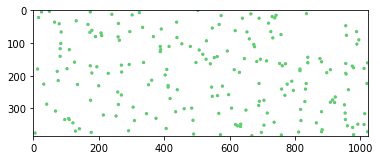

### 点图叠加地图背景

使用 Arctern 的 `plot_pointmap` 方法根据出租车运营数据绘制带地图背景的点图。其中，点的位置为上车地点、点的大小为 10、颜色为 #2DEF4A、不透明度为 1。

```python
fig, ax = plt.subplots(figsize=(10, 6), dpi=200)
arctern.plot_pointmap(ax, 
                      arctern.ST_Point(df.pickup_longitude,df.pickup_latitude),
                      bbox,
                      point_size=10,
                      point_color="#2DEF4A",
                      opacity=1,
                      coordinate_system="EPSG:4326")
```

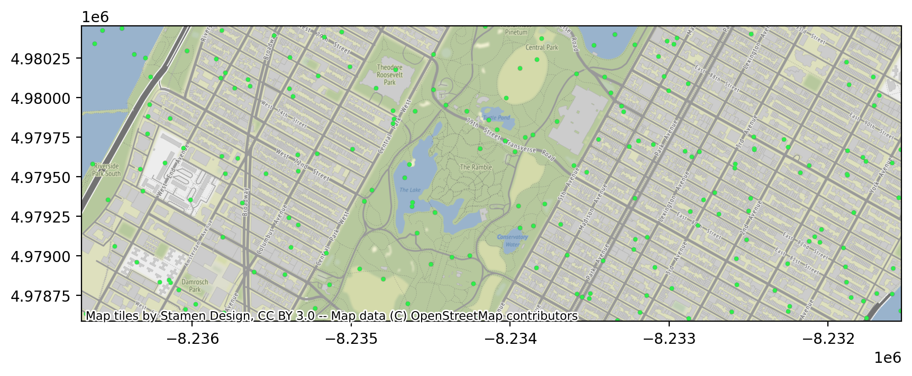

## 带权点图

### 透明带权点图

通过 Arctern 的 `vega_weighted_pointmap` 和 `weighted_point_map_layer` 方法根据出租车运营数据绘制带权点图。其中，点的位置为上车地点，点的颜色根据出租车的行程费用（`df.fare_amount`）在 #115f9a ～ #d0f400 之间变化，点的大小根据出租车的总费用（`df.total_amount`）在 5 ～ 30 之间变化，点的不透明度为 1。

```python
color_bound=[df.fare_amount.min(), df.fare_amount.max()]

size_bound=[5, 30]
total_max=df.total_amount.max()
total_min=df.total_amount.min()
size_weights = [(v-total_min)/(total_max-total_min)*(size_bound[1]-size_bound[0])+size_bound[0] for v in df.total_amount]
size_weights = pd.Series(size_weights)

point_vega = vega.vega_weighted_pointmap(1024, 
                                    384, 
                                    bounding_box=bbox, 
                                    color_gradient=["#115f9a", "#d0f400"], 
                                    color_bound=color_bound,
                                    size_bound=size_bound,
                                    opacity=1.0, 
                                    coordinate_system="EPSG:4326")
png = arctern.weighted_point_map_layer(point_vega, 
                                       arctern.ST_Point(df.pickup_longitude,df.pickup_latitude),
                                       color_weights=df.fare_amount,
                                       size_weights=size_weights)
save_png(png, "/tmp/arctern_weighted_pointmap.png")
plt.imshow(mpimg.imread("/tmp/arctern_weighted_pointmap.png"))
```

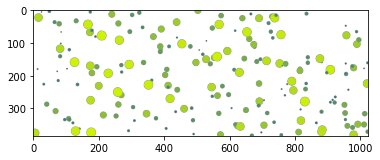

### 带权点图叠加地图背景

使用 Arctern 的 `plot_weighted_pointmap` 方法根据出租车运营数据绘制带地图背景的带权点图。其中，点的位置为上车地点，点的颜色根据出租车的行程费用（`df.fare_amount`）在 #115f9a ～ #d0f400 之间变化，点的大小根据出租车的总费用（`df.total_amount`）在 5 ～ 30 之间变化，点的不透明度为 1。

```python
color_bound=[df.fare_amount.min(), df.fare_amount.max()]

size_bound=[5, 30]
total_max=df.total_amount.max()
total_min=df.total_amount.min()
size_weights = [(v-total_min)/(total_max-total_min)*(size_bound[1]-size_bound[0])+size_bound[0] for v in df.total_amount]
size_weights = pd.Series(size_weights)

fig, ax = plt.subplots(figsize=(10, 6), dpi=200)
arctern.plot_weighted_pointmap(ax, 
                       arctern.ST_Point(df.pickup_longitude,df.pickup_latitude), 
                       color_weights=df.fare_amount,
                       size_weights=size_weights,
                       bounding_box=bbox, 
                       color_gradient=["#115f9a", "#d0f400"], 
                       color_bound=color_bound, 
                       size_bound=size_bound, 
                       opacity=1.0, 
                       coordinate_system="EPSG:4326")
```


## 热力图

### 透明热力图

通过 Arctern 的 `vega_heatmap` 和 `heat_map_layer` 方法根据出租车运营数据绘制热力图。其中，每个位置的颜色由出租车的总费用（`df.total_amount`）决定。

```python
head_vega = vega.vega_heatmap(1024, 
                              384, 
                              bounding_box=bbox, 
                              map_zoom_level=13.0, 
                              coordinate_system="EPSG:4326")
png = arctern.heat_map_layer(head_vega, 
                     arctern.ST_Point(df.pickup_longitude,df.pickup_latitude), 
                     weights=df.fare_amount)
save_png(png, "/tmp/arctern_heatmap.png")
plt.imshow(mpimg.imread("/tmp/arctern_heatmap.png"))
```

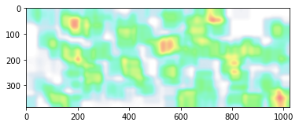

### 热力图叠加地图背景

使用 Arctern 的 `plot_heatmap` 方法根据出租车运营数据绘制带地图背景的热力图。其中，每个位置的颜色由出租车的总费用（`df.total_amount`）决定。

```python
fig, ax = plt.subplots(figsize=(10, 6), dpi=200)
arctern.plot_heatmap(ax, 
                     arctern.ST_Point(df.pickup_longitude,df.pickup_latitude), 
                     weights=df.fare_amount, 
                     bounding_box=bbox, 
                     coordinate_system="EPSG:4326")
```

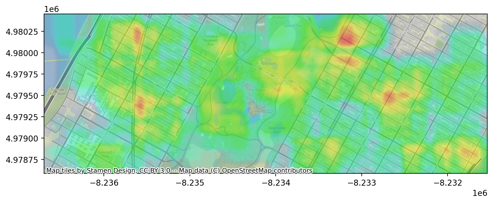

## 轮廓图

轮廓图能够绘制一块地理区域内的大量建筑轮廓。为了简单演示如何绘制轮廓图，我们只创建 `p1`、`p2` 两个 POLYGEN 对象以描述两个建筑物的轮廓。

```python
p1="POLYGON ((-73.9559920952719 40.7798302112586,-73.9558373836227 40.780041920447,-73.955817052153 40.7800697417696,-73.9561541507251 40.7802120850128,-73.9560310179165 40.780380581462,-73.9559809829928 40.7804490491413,-73.9554245436102 40.780214085171,-73.9552722050953 40.7801497573115,-73.9554553121101 40.7798991968954,-73.9556088484124 40.7796890996611,-73.955620419799 40.7796732651862,-73.9559015149432 40.7797919620232,-73.9559920952719 40.7798302112586))"
p2="POLYGON ((-73.9542329907899 40.7787670145087,-73.9545101860555 40.7783876598084,-73.9546846384315 40.778461320293,-73.9548206058685 40.7785187302746,-73.9549036921298 40.7785538112695,-73.9550251774329 40.7786051054324,-73.9550562469185 40.7786182243649,-73.9549683394669 40.7787385313679,-73.9547798956672 40.778996428053,-73.954779053804 40.7789975803655,-73.9545166590009 40.7788867891633,-73.9544446005066 40.7788563633454,-73.9542329907899 40.7787670145087))"
```

### 透明轮廓图

通过 Arctern 的 `vega_choroplethmap` 和 `choropleth_map_layer` 方法根据两个建筑物的轮廓描述（`p1`、`p2`）绘制轮廓图。

```python
choropleth_vega = vega.vega_choroplethmap(1024, 
                                          384, 
                                          bounding_box=bbox, 
                                          color_gradient=["#115f9a", "#d0f400"], 
                                          color_bound=[5, 30], 
                                          opacity=1.0, 
                                          coordinate_system="EPSG:4326")
png = arctern.choropleth_map_layer(choropleth_vega, 
                                   arctern.ST_GeomFromText(pd.Series([p1,p2])),
                                   weights=pd.Series([5,30]))
save_png(png, "/tmp/arctern_choroplethmap.png")
plt.imshow(mpimg.imread("/tmp/arctern_choroplethmap.png"))
```

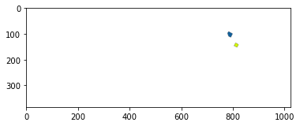

### 轮廓图叠加地图背景

使用 Arctern 的 `plot_choroplethmap` 方法根据两个建筑物的轮廓描述（`p1`、`p2`）绘制带地图背景的轮廓图。

```python
fig, ax = plt.subplots(figsize=(10, 6), dpi=200)
arctern.plot_choroplethmap(ax, 
                           arctern.ST_GeomFromText(pd.Series([p1,p2])),
                           weights=pd.Series([5,30]),
                           bounding_box=bbox, 
                           color_gradient=["#115f9a", "#d0f400"], 
                           color_bound=[5, 30], 
                           opacity=1.0, 
                           coordinate_system="EPSG:4326")
```

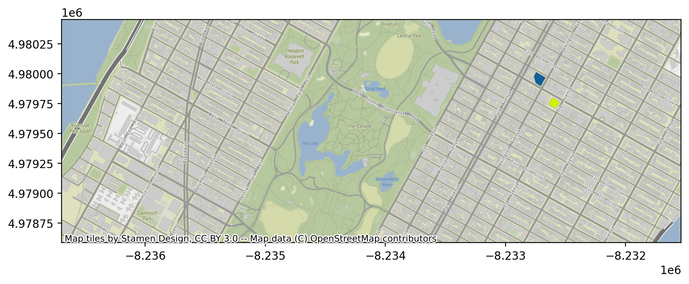

## 图标图

执行以下命令下载图标，你将用此图标绘制图标图。

```bash
wget https://raw.githubusercontent.com/zilliztech/arctern-docs/master/img/icon/arctern-icon-small.png -o /tmp/arctern-logo.png
```

### 透明图标图

通过 Arctern 的 `vega_icon` 和 `icon_viz_layer` 方法根据出租车运营数绘制图标图。其中，图标的位置为上车地点。

```python
icon_vega = vega.vega_icon(1024, 
                           384, 
                           bounding_box=bbox, 
                           icon_path="/tmp/arctern-logo.png", 
                           coordinate_system="EPSG:4326")
png = arctern.icon_viz_layer(icon_vega,
                             arctern.ST_Point(df.pickup_longitude,df.pickup_latitude))
save_png(png, "/tmp/arctern_iconviz.png")
plt.imshow(mpimg.imread("/tmp/arctern_iconviz.png"))
```

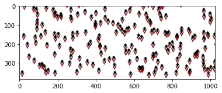

### 图标图叠加地图背景

使用 Arctern 的 `plot_iconviz` 方法根据出租车运营数绘制带地图背景的图标图。其中，图标的位置为上车地点。

```python
fig, ax = plt.subplots(figsize=(10, 6), dpi=200)
arctern.plot_iconviz(ax, 
                     arctern.ST_Point(df.pickup_longitude,df.pickup_latitude),  
                     icon_path="/tmp/arctern-logo.png", 
                     bounding_box=bbox,
                     coordinate_system="EPSG:4326")
```

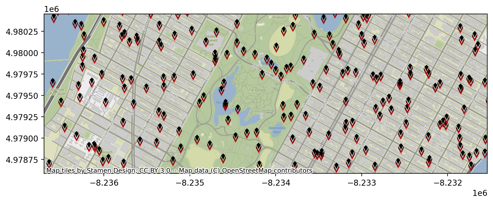

## 渔网图

### 透明渔网图

使用 Arctern 的 `vega_fishnetmap` 和 `fishnet_map_layer` 方法根据出租车运营数绘制图标图。其中，网点的位置为上车地点。

```python
fish_vega = vega.vega_fishnetmap(1024, 
                                 384, 
                                 bounding_box=bbox, 
                                 cell_size=8, 
                                 cell_spacing=1, 
                                 opacity=1.0, 
                                 coordinate_system="EPSG:4326")
png = arctern.fishnet_map_layer(fish_vega,
                                arctern.ST_Point(df.pickup_longitude,df.pickup_latitude), 
                                weights=df.fare_amount)
save_png(png, "/tmp/arctern_fishnetmap.png")
plt.imshow(mpimg.imread("/tmp/arctern_fishnetmap.png"))
```

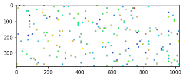

### 渔网图叠加地图背景

使用 Arctern 的 `plot_fishnetmap` 方法根据出租车运营数绘制渔网图。其中，网点的位置为上车地点。

```python
fig, ax = plt.subplots(figsize=(10, 6), dpi=200)
arctern.plot_fishnetmap(ax, 
                        arctern.ST_Point(df.pickup_longitude,df.pickup_latitude), 
                        weights=df.fare_amount, 
                        bounding_box=bbox, 
                        cell_size=8, 
                        cell_spacing=1, 
                        opacity=1.0, 
                        coordinate_system="EPSG:4326")
```

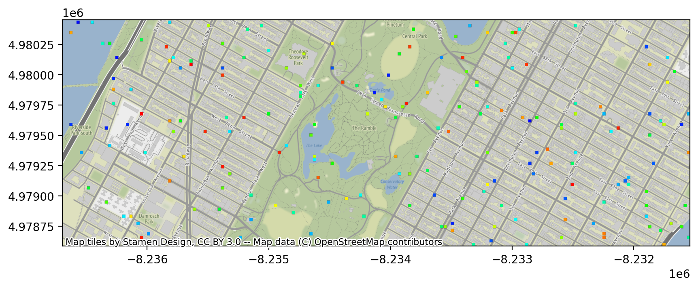