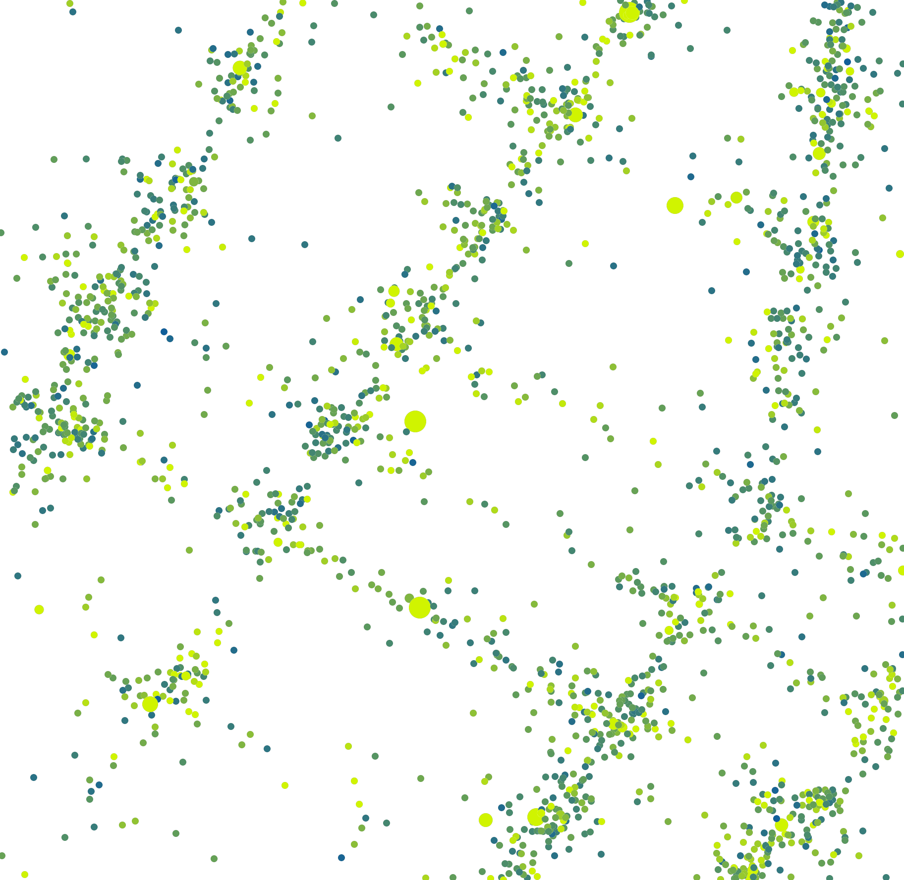

# weighted_point_map_layer

绘制一个带权点图。需要先后调用 vega_weighted_pointmap 和 weighted_point_map_layer 两个接口。首先使用 vega_weighted_pointmap 构建描述带权点图渲染样式的 VegaWeightedPointMap 对象，然后使用 weighted_point_map_layer 渲染图像。

## vega_weighted_pointmap 

**arctern.util.vega.vega_weighted_pointmap(width,height,bounding_box,color_gradient,
color_bound,size_bound,opacity,coordinate_system)**

&#x2002; &#x2003; 根据给定的配置参数，构建描述带权点图渲染样式的 VegaWeightedPointMap 对象。

&#x2002; &#x2003; 参数

&#x2002; &#x2003; &#x2002; &#x2003; * width(int) -- 图片宽度，单位为像素个数。

&#x2002; &#x2003; &#x2002; &#x2003; * height(int) -- 图片高度，单位为像素个数。

&#x2002; &#x2003; &#x2002; &#x2003; * bounding_box(list) -- 图片对应的地理坐标区域，以 [x_min, y_min, x_max, y_max] 的形式表示一个矩形区域。图片左下角的像素坐标 (0, 0) 对应地理坐标 (x_min, y_min) ，图片右上角的像素坐标 (width, height) 对应地理坐标 (x_max, y_max)。

&#x2002; &#x2003; &#x2002; &#x2003; * color_gradient(list) -- 点的颜色渐变范围，表示形式为 ["hex_color"] 或 ["hex_color1", "hex_color2"]。当形式为["hex_color"] 时所有点的颜色相同。当形式为["hex_color1", "hex_color2"] 时点的颜色由输入数据中一列的值（权重）决定，且颜色在 "hex_color1" ~ "hex_color2" 之间变化。

&#x2002; &#x2003; &#x2002; &#x2003; * color_bound(list) -- 可选参数，用于描述权重与颜色的对应关系，仅当color_gradient中包含两个颜色值时需要设置，表示形式为 [color_min, color_max]。权重值小于等于 color_min 时点的颜色为"hex_color1"， 权重值大于等于 color_max 时点的颜色为"hex_color2"。

&#x2002; &#x2003; &#x2002; &#x2003; * size_bound(list) -- 可选参数，用于描述点的直径范围，表示形式为 [diameter] 或 [diameter_min, diameter_max]，默认值为[3]。[diameter] 形式表示所有点的直径都为 diameter; [diameter_min, diameter_max] 形式表示点的直径由输入数据中一列的值（权重）决定，且在 diameter_min ~ diameter_max 之间变化; 权重值小于等于 diameter_min 时点的直径为 diameter_min，权重值大于等于 diameter_max 时点的直径为 diameter_max; 权重值在 diameter_min ~ diameter_max 之间时点的直径与权重值相等。

&#x2002; &#x2003; &#x2002; &#x2003; * opacity(float) -- 可选参数，表示点的不透明度，范围为 0.0 ~ 1.0，默认值为 1.0。

&#x2002; &#x2003; &#x2002; &#x2003; * coordinate_system(str) -- 可选参数，表示输入数据所属的地理坐标系统，默认值为"EPSG:3857"，当前支持的地理坐标系统请参照 <https://spatialreference.org/>。


&#x2002; &#x2003; 返回值类型
   
&#x2002; &#x2003; &#x2002; &#x2003; arctern.util.vega.pointmap.vega_weighted_pointmap.VegaWeightedPointMap


&#x2002; &#x2003; 返回

&#x2002; &#x2003; &#x2002; &#x2003; 用于描述渲染样式的 VegaWeightedPointMap 对象。


## weighted_point_map_layer 

**arctern.weighted_point_map_layer(vega, points, color_weights, size_weights)**

&#x2002; &#x2003; 绘制带权重的点图，权重用于决定点的大小和颜色。

&#x2002; &#x2003; 参数

&#x2002; &#x2003; &#x2002; &#x2003; * vega(VegaWeightedPointMap) -- VegaWeightedPointMap 对象。

&#x2002; &#x2003; &#x2002; &#x2003; * points(Series(dtype: object)) -- 所需绘制的点，格式为WKB。

&#x2002; &#x2003; &#x2002; &#x2003; * color_weights(Series(dtype: float64|int64)) -- 可选参数，点的颜色权重。

&#x2002; &#x2003; &#x2002; &#x2003; * size_weights(Series(dtype: float64|int64)) -- 可选参数，点的大小权重。


&#x2002; &#x2003; 返回值类型
   
&#x2002; &#x2003; &#x2002; &#x2003; bytes


&#x2002; &#x2003; 返回

&#x2002; &#x2003; &#x2002; &#x2003; base64编码的png图片。


### 示例:

  ```python
      >>> import pandas as pd
      >>> import numpy as np
      >>> import arctern
      >>> from arctern.util import save_png
      >>> from arctern.util.vega import vega_weighted_pointmap
      >>> 
      >>> # 读取 csv 文件并创建绘图数据
      >>> # test_data.csv下载链接: https://github.com/zilliztech/arctern-resources/raw/benchmarks/benchmarks/dataset/layer_rendering_test_data/test_data.csv
      >>> df = pd.read_csv("/path/to/test_data.csv", dtype={'longitude':np.float64, 'latitude':np.float64, 'color_weights':np.float64, 'size_weights':np.float64, 'region_boundaries':np.object})
      >>> region = arctern.ST_GeomFromText(pd.Series(['POLYGON ((-73.99668712186558 40.72972339069935, -73.99668712186558 40.7345193345495, -73.99045479584949 40.7345193345495, -73.99045479584949 40.72972339069935, -73.99668712186558 40.72972339069935))']))
      >>> d=pd.DataFrame(region).T
      >>> region = region.append([d]*(df.shape[0] - 1))
      >>> in_region = arctern.ST_Within(arctern.ST_Point(df['longitude'], df['latitude']), region[0])
      >>> df['in_region']=in_region
      >>> input1 = df[df.in_region == True].head(20000).reset_index()
      >>> input2 = df[df.in_region == True].head(2000).reset_index()
      >>> 
      >>> points1 = arctern.ST_Point(input1['longitude'], input1['latitude'])
      >>> points2 = arctern.ST_Point(input2['longitude'], input2['latitude'])
      >>> 
      >>> # 绘制带权点图，点的大小为 16，点的颜色根据 input1['color_weights'] 在 "#115f9a" ~ "#d0f400" 之间变化
      >>> vega1 = vega_weighted_pointmap(1740, 1767, bounding_box=[-73.99668712186558,40.72972339069935,-73.99045479584949,40.7345193345495], color_gradient=["#115f9a", "#d0f400"], color_bound=[2.5,15], size_bound=[16], opacity=1.0, coordinate_system="EPSG:4326")
      >>> png1 = arctern.weighted_point_map_layer(vega1, points1, color_weights=input1['color_weights'])
      >>> save_png(png1, "/tmp/python_weighted_pointmap_1_0.png")  
      >>> 
      >>> # 绘制带权点图，点的颜色为'#37A2DA'，点的大小根据 input2['size_weights'] 在 15 ~ 50 之间变化
      >>> vega2 = vega_weighted_pointmap(1740, 1767, bounding_box=[-73.99668712186558,40.72972339069935,-73.99045479584949,40.7345193345495], color_gradient=["#37A2DA"], size_bound=[15, 50], opacity=1.0, coordinate_system="EPSG:4326")
      >>> png2 = arctern.weighted_point_map_layer(vega2, points2, size_weights=input2['size_weights'])
      >>> save_png(png2, '/tmp/python_weighted_pointmap_0_1.png')  
      >>> 
      >>> # 绘制带权点图，点的颜色根据 input2['color_weights'] 在 "#115f9a" ~ "#d0f400" 之间变化，点的大小根据 input2['size_weights'] 在 15 ~ 50 之间变化
      >>> vega3 = vega_weighted_pointmap(1740, 1767, bounding_box=[-73.99668712186558,40.72972339069935,-73.99045479584949,40.7345193345495], color_gradient=["#115f9a", "#d0f400"], color_bound=[2.5,15], size_bound=[15, 50], opacity=1.0, coordinate_system="EPSG:4326")
      >>> png3 = arctern.weighted_point_map_layer(vega3, points2, color_weights=input2['color_weights'], size_weights=input2['size_weights'])
      >>> save_png(png3, '/tmp/python_weighted_pointmap_1_1.png')
   ```

渲染结果如下：


