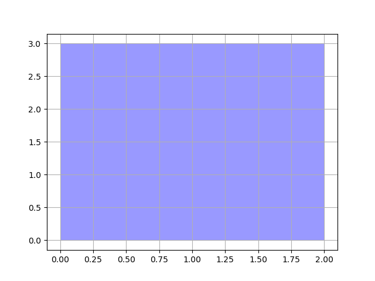

# Aggregation
Spatial data processing has extensive demands for aggregation operations. Currently, Arctern only supports two aggregation methods: `unary_union` and `envelope_aggr`. The description of these methods are as follows:
 - **unary_union:** Returns a geometry that represents the union of a set of geometries.
 - **envelope_aggr:** Calculate the minimum rectangular bounding box that contains a set of geometries, and the sides of the rectangle are parallel to the coordinate axis.

This article describes how to use the aggregation methods of Arctern GeoSeries.

## Generating test data

Create a GeoSeries object that contains two polygons:

```python
>>> from arctern import GeoSeries
>>> polygon_s = GeoSeries(["POLYGON ((0 0,0 1,1.5 2,0 0))", "POLYGON ((1 1,2 1,2 3,1 1))"])
```
The two geometries in `polygon_s` are shown below:

    

## Tests

### Get the union of a set of geometries

Select all the elements of `polygon_s` and use the `unary_union` method to get their union:

```python
>>> polygon_s[[0,1]].unary_union()
0    MULTIPOLYGON (((0 0,0 1,1 1,0 0)),((1 1,2 3,2 1,1 1)))
dtype: GeoDtype
```
The aggregation results are shown in the following figure:


### Get the minimum rectangular bounding box of a set of geometries

Select all the elements of `polygon_s` and use the `envelope_aggr` method to get their minimum rectangular bounding box:

```python
>>> geos[[0,2]].envelope_aggr()
0    POLYGON ((0 0,0 3,2 3,2 0,0 0))
dtype: GeoDtype
```
The aggregation results are shown in the following figure:

