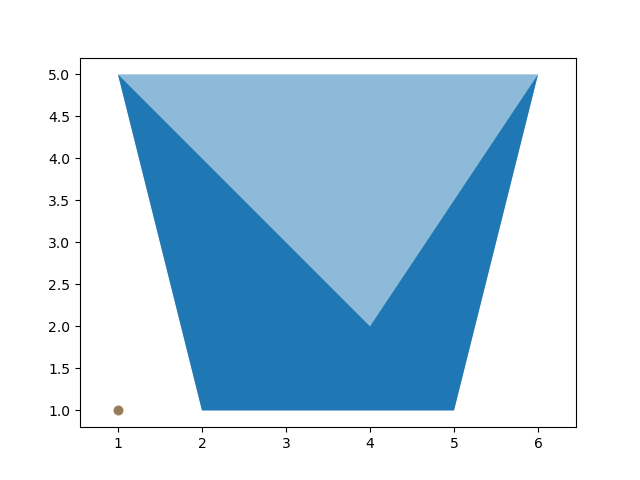
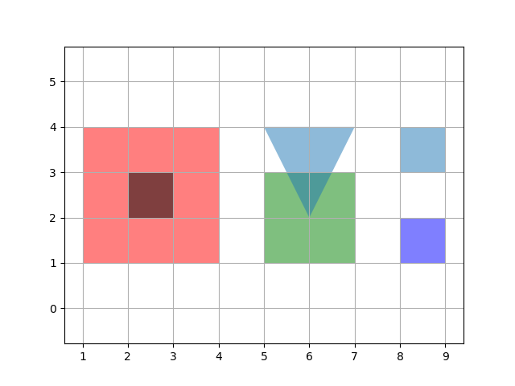
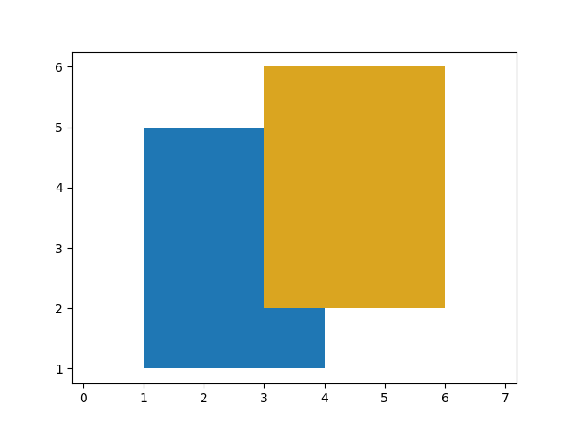
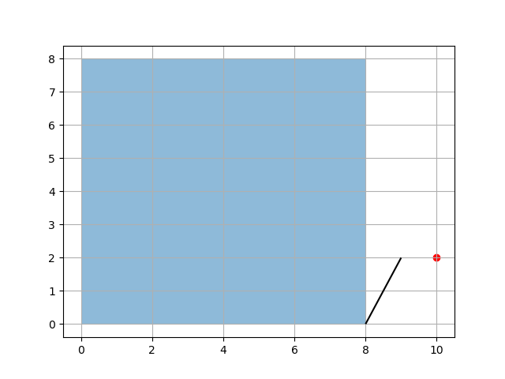
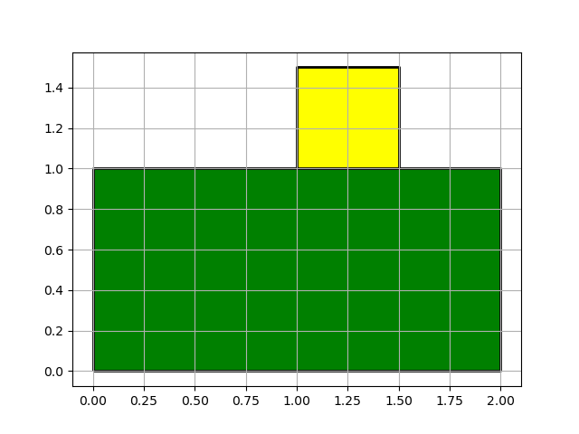
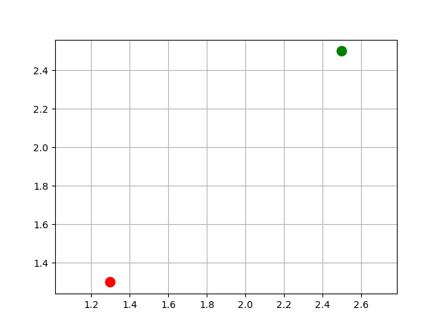

# Basic manipulations of geometry

Arctern implements multiple GIS processing functions that comply with the OGC standard. They are encapsulated as attributes and methods of the GeoSeries class. The methods are divided into unary operation methods and binary operation methods.

## GeoSeries.length

* **Functions:** Calculate the length of each geometry in the GeoSeries object. If the geometry is not of type LineString and MultiLineString, its length is 0.
* **Returns:** Floating point pandas.Series

```python
>>> from arctern import GeoSeries
>>> s = GeoSeries(["POINT(1 1)", "LINESTRING (0 0, 0 2)", "POLYGON ((0 0,0 4,4 4,0 0))"])
>>> s.length
0    0.0
1    2.0
2    0.0
dtype: float64
```

## GeoSeries.area

* **Functions:** Calculate the area of each geometry in a GeoSeries object.
* **Returns:** Floating point pandas.Series

```python
>>> from arctern import GeoSeries
>>> s = GeoSeries(["POINT(1 1)", "POLYGON ((2 1, 3 3, 1 3, 2 1))"])
>>> s.area
0    0.0
1    2.0
dtype: float64
```


## GeoSeries.centroid

* **Functions:** Calculate the center point of each geometry in a GeoSeries object.
* **Returns:** GeoSeries。

```python
>>> from arctern import GeoSeries
>>> s = GeoSeries(["POLYGON ((1 1, 1.5 1, 1.5 1.25, 1 1.25, 1 1))", "POLYGON ((2 1, 3 3, 1 3, 2 1))"])
>>> s.centroid
0              POINT (1.25 1.125)
1    POINT (2.0 2.33333333333333)
dtype: float64
```


## GeoSeries.is_valid

* **Functions:** Determine whether each geometry in the GeoSeries object is valid.
* **Returns:** Boolean pandas.Series
  * **True:** Geometry is valid。
  * **False:** Geometry is invalid。

```python
>>> from arctern import GeoSeries
>>> s = GeoSeries(["POINT(1 1)", "POINT(1)"])
>>> s.is_valid
0     True
1    False
dtype: bool
```

## GeoSeries.is_simple

* **Functions:** Determine if each geometry in the GeoSeries object is simple. "Simple" here means that a certain geometric figure has no abnormal geometric figure points, such as self-intersection or tangent.
* **Returns:** Boolean pandas.Series
  * **True:** Geometry is simple.
  * **False:** Geometry is not simple.

```python
>>> from arctern import GeoSeries
>>> s = GeoSeries(["POINT(1 1)", "LINESTRING (1 2,2 3,1 2,4 6,2 2,1 6)"])
>>> s.is_simple
0     True
1    False
dtype: bool
```


## GeoSeries.convex_hull

* **Functions:** For each geometry in the GeoSeries object, calculate the smallest convex geometry surrounding it.
* **Returns:** GeoSeries

```python
>>> from arctern import GeoSeries
>>> s = GeoSeries(["POINT(1 1)", "POLYGON ((2 1, 5 1, 6 5, 4 2, 1 5, 2 1))"])
>>> s.convex_hull
0                        POINT (1 1)
1    POLYGON ((2 1,1 5,6 5,5 1,2 1))
dtype: GeoDtype
```


## GeoSeries.npoints

* **Functions:** For each geometry in the GeoSeries object, calculate the number of points.
* **Returns:** int64 type pandas.Series

```python
>>> from arctern import GeoSeries
>>> s = GeoSeries(["POINT(1 1)", "POLYGON ((1 1, 3 1, 3 3, 1 3, 1 1))"])
>>> s.npoints
0    1
1    5
dtype: int64
```

## GeoSeries.curve_to_line

* **Functions:** For each geometry in the GeoSeries object, calculate its approximate representation. The approximate representation method is to convert the curve in each geometric figure into an approximate linear representation.
* **Returns:** GeoSeries

```python
>>> from arctern import GeoSeries
>>> s = GeoSeries(["CURVEPOLYGON(CIRCULARSTRING(0 0, 4 0, 4 4, 0 4, 0 0))"])
>>> s.curve_to_line()
0    POLYGON ((0 0,0.144384846968599 -0.1346410480079,0.297810064436987 -0.258882339403264,0.459528180167908 -0.372118583103131,0.628751319757384 -0.473798103510646,0.804655045079528 -0.563425528223178,0.986382370866408 -0.640564201436803,1.17304793985397 -0.704838311289649,1.36374233615356 -0.755934720779265,1.55753651583507 -0.793604493334868,1.75348633313513 -0.817664105611044,1.9506371402407 -0.827996341595309,2.14802843823713 -0.824550863672528,2.34469855656221 -0.807344457864786,2.53968933816861 -0.776460952051593,2.73205080756895 -0.732050807568896,2.92084579902018 -0.674330386176507,3.10515452230186 -0.603580895965422,3.28407904384051 -0.520147021340222,3.45674766135266 -0.424435243751333,3.6223191506906 -0.316911861358278,3.7799868642013 -0.198100717271856,3.92898266063321 -0.068580647443195,4.06858064744324 0.071017339366811,4.19810071727193 0.220013135798766,4.31691186135845 0.377680849309456,4.42443524375153 0.543252338647363,4.52014702134033 0.715920956159607,4.60358089596548 0.894845477698254,4.67433038617651 1.07915420097987,4.73205080756907 1.26794919243116,4.77646095205159 1.46031066183144,4.80734445786493 1.65530144343791,4.82455086367258 1.85197156176298,4.82799634159551 2.04936285975941,4.81766410561113 2.24651366686498,4.7936044933349 2.44246348416505,4.75593472077935 2.63625766384655,4.70483831128968 2.82695206014614,4.64056420143697 3.0136176291337,4.56342552822321 3.19534495492053,4.47379810351072 3.37124868024273,4.3721185831032 3.54047181983219,4.2588823394035 3.70218993556301,4.13464104800801 3.85561515303141,4 4,3.85561515303141 4.13464104800801,3.70218993556307 4.25888233940338,3.54047181983219 4.3721185831032,3.37124868024273 4.47379810351072,3.19534495492053 4.56342552822321,3.0136176291337 4.64056420143697,2.82695206014614 4.70483831128968,2.63625766384655 4.75593472077935,2.44246348416505 4.7936044933349,2.24651366686498 4.81766410561113,2.04936285975941 4.82799634159551,1.85197156176298 4.82455086367258,1.65530144343791 4.80734445786493,1.46031066183144 4.77646095205159,1.26794919243116 4.73205080756907,1.07915420097987 4.67433038617651,0.894845477698254 4.60358089596548,0.715920956159607 4.52014702134033,0.543252338647363 4.42443524375153,0.377680849309442 4.31691186135845,0.220013135798759 4.19810071727193,0.071017339366808 4.06858064744324,-0.068580647443198 3.92898266063321,-0.198100717271863 3.7799868642013,-0.316911861358292 3.6223191506906,-0.424435243751333 3.45674766135266,-0.520147021340222 3.28407904384051,-0.603580895965422 3.10515452230175,-0.674330386176507 2.92084579902018,-0.732050807568896 2.73205080756895,-0.776460952051593 2.53968933816861,-0.807344457864786 2.34469855656221,-0.824550863672528 2.14802843823713,-0.827996341595309 1.9506371402407,-0.817664105611044 1.75348633313513,-0.793604493334868 1.55753651583507,-0.755934720779265 1.36374233615356,-0.704838311289649 1.17304793985397,-0.640564201436803 0.986382370866408,-0.563425528223178 0.804655045079528,-0.473798103510646 0.628751319757356,-0.372118583103131 0.459528180167908,-0.258882339403271 0.29781006443698,-0.134641048007893 0.144384846968599,0 0))
dtype: GeoDtype
```


## GeoSeries.simplify(tolerance)

* **Functions:** For each geometry in the GeoSeries object, calculate its simplified representation. The simplified representation algorithm is Douglas-Peucker algorithm.
* **Parameters:** `tolerance` is a floating-point number, indicating the maximum distance between a point on the line string and the curve.
* **Returns:** GeoSeries

```python
>>> from arctern import GeoSeries
>>> s = GeoSeries(["POLYGON ((1 1,1 2,2 2,2 1,1 1))", "CIRCULARSTRING (0 0,1 1,2 0)"])
>>> s.simplify(1.0)
0    POLYGON ((1 1,1 2,2 2,2 1,1 1))
1               LINESTRING (0 0,2 0)
dtype: GeoDtype
```

## GeoSeries.envelope

* **Functions:** For each geometry in the GeoSeries object, calculate its minimum rectangular bounding box.
* **Returns:** GeoSeries

```python
>>> from arctern import GeoSeries
>>> s = GeoSeries(["POINT(1 1)", "POLYGON ((4.76 3.16, 3.67 5.17, 2.85 2.21, 4.04 0.99, 7.00 2.83))"])
>>> s.envelope
0                                                    POINT (1 1)
1    POLYGON ((2.85 0.99,2.85 5.17,7.0 5.17,7.0 0.99,2.85 0.99))
dtype: GeoDtype
```


## GeoSeries.buffer(distance)

* **Functions:** For each geometry in the GeoSeries object, create a geometry with the maximum distance not greater than `distance`.
* **Parameters** `distance` is a floating point number, indicating the maximum distance between the new geometry and the original geometry.
* **Returns:** GeoSeries

### Example 1

Setting `distance` to 0 returns an empty polygon.

```python
>>> from arctern import GeoSeries
>>> s = GeoSeries(["POINT (0 1)"])
>>> s.buffer(0.0)
0    POLYGON EMPTY
dtype: GeoDtype
```
### Example 2

Setting `distance` to 1.0 returns a polygon. The polygon approximately represents a circle with a radius of 1.0 and a center of `Point(0, 1)`, and the area of the circle is approximately 3.14.

```python
>>> from arctern import GeoSeries
>>> s = GeoSeries(["POINT (0 1)"])
>>> result = s.buffer(1.0)
>>> result
0    POLYGON ((1 1,0.998629534754574 0.947664043757056,0.994521895368273 0.895471536732347,0.987688340595138 0.843565534959769,0.978147600733806 0.792088309182241,0.965925826289068 0.741180954897479,0.951056516295154 0.690983005625053,0.933580426497202 0.6416320504547,0.913545457642601 0.5932633569242,0.891006524188368 0.546009500260454,0.866025403784439 0.5,0.838670567945424 0.455360964984973,0.809016994374948 0.412214747707527,0.777145961456971 0.370679608950163,0.743144825477395 0.330869393641142,0.707106781186548 0.292893218813453,0.669130606358859 0.256855174522606,0.629320391049838 0.22285403854303,0.587785252292474 0.190983005625053,0.544639035015028 0.161329432054576,0.5 0.133974596215562,0.453990499739548 0.108993475811633,0.406736643075801 0.0864545423574,0.358367949545302 0.066419573502799,0.309016994374949 0.048943483704847,0.258819045102522 0.034074173710932,0.207911690817761 0.021852399266195,0.156434465040233 0.012311659404863,0.104528463267656 0.005478104631727,0.052335956242946 0.001370465245426,0.0 0.0,-0.052335956242941 0.001370465245426,-0.104528463267651 0.005478104631726,-0.156434465040228 0.012311659404862,-0.207911690817756 0.021852399266194,-0.258819045102518 0.034074173710931,-0.309016994374944 0.048943483704845,-0.358367949545297 0.066419573502797,-0.406736643075797 0.086454542357398,-0.453990499739544 0.10899347581163,-0.5 0.13397459621556,-0.544639035015024 0.161329432054574,-0.58778525229247 0.19098300562505,-0.629320391049834 0.222854038543026,-0.669130606358855 0.256855174522603,-0.707106781186544 0.292893218813449,-0.743144825477391 0.330869393641138,-0.777145961456968 0.370679608950159,-0.809016994374944 0.412214747707523,-0.838670567945421 0.455360964984969,-0.866025403784436 0.5,-0.891006524188365 0.546009500260448,-0.913545457642599 0.593263356924195,-0.9335804264972 0.641632050454694,-0.951056516295152 0.690983005625047,-0.965925826289067 0.741180954897473,-0.978147600733804 0.792088309182235,-0.987688340595137 0.843565534959763,-0.994521895368273 0.89547153673234,-0.998629534754574 0.94766404375705,-1.0 1.0,-0.998629534754574 1.05233595624294,-0.994521895368274 1.10452846326765,-0.987688340595139 1.15643446504022,-0.978147600733807 1.20791169081775,-0.96592582628907 1.25881904510251,-0.951056516295156 1.30901699437494,-0.933580426497205 1.35836794954529,-0.913545457642604 1.40673664307579,-0.891006524188372 1.45399049973954,-0.866025403784443 1.5,-0.838670567945429 1.54463903501502,-0.809016994374952 1.58778525229247,-0.777145961456976 1.62932039104983,-0.7431448254774 1.66913060635885,-0.707106781186554 1.70710678118654,-0.669130606358865 1.74314482547739,-0.629320391049845 1.77714596145697,-0.58778525229248 1.80901699437494,-0.544639035015034 1.83867056794542,-0.5 1.86602540378443,-0.453990499739554 1.89100652418836,-0.406736643075807 1.9135454576426,-0.358367949545307 1.9335804264972,-0.309016994374954 1.95105651629515,-0.258819045102528 1.96592582628907,-0.207911690817766 1.9781476007338,-0.156434465040237 1.98768834059514,-0.10452846326766 1.99452189536827,-0.05233595624295 1.99862953475457,-0.0 2.0,0.052335956242939 1.99862953475457,0.104528463267649 1.99452189536827,0.156434465040226 1.98768834059514,0.207911690817755 1.97814760073381,0.258819045102517 1.96592582628907,0.309016994374944 1.95105651629515,0.358367949545297 1.9335804264972,0.406736643075797 1.9135454576426,0.453990499739544 1.89100652418837,0.5 1.86602540378444,0.544639035015025 1.83867056794543,0.587785252292471 1.80901699437495,0.629320391049836 1.77714596145697,0.669130606358857 1.7431448254774,0.707106781186547 1.70710678118655,0.743144825477394 1.66913060635886,0.777145961456971 1.62932039104984,0.809016994374947 1.58778525229247,0.838670567945424 1.54463903501503,0.866025403784439 1.5,0.891006524188368 1.45399049973955,0.913545457642601 1.4067366430758,0.933580426497202 1.3583679495453,0.951056516295154 1.30901699437495,0.965925826289069 1.25881904510252,0.978147600733806 1.20791169081776,0.987688340595138 1.15643446504023,0.994521895368274 1.10452846326765,0.998629534754574 1.05233595624294,1 1))
dtype: GeoDtype
>>> result.area
0    3.140157
dtype: float64
```


## GeoSeries.precision_reduce(precision)

* **Functions:** For each geometry in the GeoSeries object, the geometry with reduced coordinate accuracy is created according to the specified valid digits number `precision`.
* **Parameters:** `precision` is an integer number, indicating the number of valid digits.
* **Returns:** GeoSeries

In the following example, since the effective digits are set to 3, the coordinates of all points in the result retain only 3 valid digits. In the POINT (1.333 2.666) of the coordinate, the last valid digit of 2.666 is rounded to 2.67.

```python
>>> from arctern import GeoSeries
>>> s = GeoSeries(["POINT (1.333 2.666)", "POINT (2.655 4.447)"])
>>> s.precision_reduce(3)
0    POINT (1.33 2.67)
1    POINT (2.66 4.45)
dtype: GeoDtype
```

## GeoSeries.make_valid

* **Functions:** For each geometry in the GeoSeries object, create a new valid geometry based on it. During the construction of the new geometry, no vertices of the original geometry are deleted. If the original geometry is already valid, then return the original geometry directly.
* **Returns:** GeoSeries

In the following example, the imported geometry is self-intersecting near POINT (2 2). Therefore, the `make_valid` method returns a new union of geometry, which contains a polygon and a line string.

```python
>>> from arctern import GeoSeries
>>> s = GeoSeries(["POLYGON ((2 1,3 1,3 2,2 2,2 8,2 1))"])
>>> s.make_valid()
Warning 1: Self-intersection at or near point 2 2
0    GEOMETRYCOLLECTION (POLYGON ((2 2,3 2,3 1,2 1,2 2)),LINESTRING (2 2,2 8))
dtype: GeoDtype
```

## GeoSeries.intersects(other)

* **Functions:** For each geometry in the GeoSeries object, check whether it intersects with the geometry at the same position in the `other` object.
* **Parameters:** `other` is GeoSeries or WKB formed object.
* **Returns:** Boolean pandas.Series
  * **True:** Two geometries have intersection.
  * **False:** Two geometries have no intersection.

### Example 1
```python
>>> from arctern import GeoSeries
>>> s1 = GeoSeries(["POLYGON((7 7,9 4,5 4,7 7))", "POLYGON((8 0,9 0,9 1,8 1,8 0))"])
>>> s2 = GeoSeries(["POLYGON((6 6,2 6,2 2,6 2,6 6))", "POLYGON((0 0,0 4,4 4,4 0,0 0))"])
>>> s2.intersects(s1)
0     True
1    False
dtype: bool
```


### Example 2
```python
>>> from arctern import GeoSeries
>>> s1 = GeoSeries(["POLYGON((7 7,9 4,5 4,7 7))"])
>>> s2 = GeoSeries(["POLYGON((6 6,2 6,2 2,6 2,6 6))", "POLYGON((0 0,0 4,4 4,4 0,0 0))"])
>>> s2.intersects(s1[0])
0     True
1    False
dtype: bool
```


### Example 3
```python
>>> from arctern import GeoSeries
>>> s1 = GeoSeries(["POLYGON((8 0,9 0,9 1,8 1,8 0))"])
>>> s2 = GeoSeries(["POLYGON((6 6,2 6,2 2,6 2,6 6))", "POLYGON((0 0,0 4,4 4,4 0,0 0))"])
>>> s2.intersects(s1[0])
0    False
1    False
dtype: bool
```


## GeoSeries.within(other)

* **Functions:** For each geometry in the GeoSeries object, check whether it is within the geometry at the same position in the `other` object.
* **Parameters:** `other` is GeoSeries or WKB formed object.
* **Returns:** Boolean pandas.Series
  * **True:** Each geometry is within other.
  * **False:** Each geometry is not within other.

```python
>>> s1 = GeoSeries(["POLYGON((1 1, 4 1, 4 4, 1 4, 1 1))", "POLYGON((5 1, 7 1, 7 3, 5 3, 5 1))", "POLYGON((8 1, 9 1, 9 2, 8 2, 8 1))"])
>>> s2 = GeoSeries(["POLYGON((2 2, 2 3, 3 3, 3 2, 2 2))", "POLYGON((5 4, 6 2, 7 4, 5 4))", "POLYGON((8 3, 9 3, 9 4, 8 4, 8 3))"])
>>> s2.within(s1)
0     True
1    False
2    False
dtype: bool
```


## GeoSeries.contains(other)

* **Functions:** For each geometry in the GeoSeries object, check whether it contains the geometry at the same position in the `other` object.
* **Parameters:** `other` is GeoSeries or WKB formed object.
* **Returns:** Boolean pandas.Series
  * **True:** Each geometry contains other.
  * **False:** Each geometry does not contain other.

```python
>>> from arctern import GeoSeries
>>> s1 = GeoSeries(["POLYGON((2 2, 2 3, 3 3, 3 2, 2 2))", "POLYGON((5 4, 6 2, 7 4, 5 4))", "POLYGON((8 3, 9 3, 9 4, 8 4, 8 3))"])
>>> s2 = GeoSeries(["POLYGON((1 1, 4 1, 4 4, 1 4, 1 1))", "POLYGON((5 1, 7 1, 7 3, 5 3, 5 1))", "POLYGON((8 1, 9 1, 9 2, 8 2, 8 1))"])
>>> s2.contains(s1)
0     True
1    False
2    False
dtype: bool
```


## GeoSeries.crosses(other)

* **Functions:** For each geometry in the GeoSeries object, check whether it crosses the geometry at the same position in the `other` object.
* **Parameters:** `other` is GeoSeries or WKB formed object.
* **Returns:** Boolean pandas.Series
  * **True:** Two geometries cross.
  * **False:** Two geometries do not cross.

```python
>>> from arctern import GeoSeries
>>> s1 = GeoSeries(["POLYGON((1 1, 4 1, 4 4, 1 4, 1 1))", "POLYGON((1 1, 4 1, 4 4, 1 4, 1 1))"])
>>> s2 = GeoSeries(["LINESTRING(1 5, 5 1)", "POLYGON((2 2, 5 2, 5 5, 2 5, 2 2))"])
>>> s2.crosses(s1)
0     True
1    False
dtype: bool
```


## GeoSeries.geom_equals(other)

* **Functions:** For each geometry in the GeoSeries object, check whether it equals the geometry at the same position in the `other` object. "equals" means that the two geometries have the same geometric structure.
* **Parameters:** `other` is GeoSeries or WKB formed object.
* **Returns:** Boolean pandas.Series
  * **True:** Two geometries equal.
  * **False:** Two geometries do not equal.

```python
>>> from arctern import GeoSeries
>>> s1 = GeoSeries(["POLYGON((0 0,1 0,1 1,0 1,0 0))", "POLYGON((8 0,9 0,9 1,8 1,8 0))"])
>>> s2 = GeoSeries(["POLYGON((0 0,0 8,8 8,8 0,0 0))", "POLYGON((0 0,0 8,8 8,8 0,0 0))"])
>>> s2.geom_equals(s1)
0    False
1    False
dtype: bool
```

## GeoSeries.touches(other)

* **Functions:** For each geometry in the GeoSeries object, check whether it touches the geometry at the same position in the `other` object. "touches" means that two geometries have a common point on the boundary.
* **Parameters:** `other` is GeoSeries or WKB formed object.
* **Returns:** Boolean pandas.Series
  * **True:** Two geometries touch.
  * **False:** Two geometries do not touch.

```python
>>> from arctern import GeoSeries
>>> s1 = GeoSeries(["POLYGON((1 1, 4 1, 4 5, 1 5, 1 1))"])
>>> s2 = GeoSeries(["POLYGON((4 2, 7 2, 7 6, 4 6, 4 2))"])
>>> s2.touches(s1)
0    True
dtype: bool
```


## GeoSeries.overlaps(other)

* **Functions:** For each geometry in the GeoSeries object, check whether it overlaps the geometry at the same position in the `other` object. "overlaps" means that the two geometries cross and do not contain each other.
* **Parameters:** `other` is GeoSeries or WKB formed object.
* **Returns:** Boolean pandas.Series
  * **True:** Two geometries overlap.
  * **False:** Two geometries do not overlap.

```python
>>> from arctern import GeoSeries
>>> s1 = GeoSeries(["POLYGON((1 1, 4 1, 4 5, 1 5, 1 1))"])
>>> s2 = GeoSeries(["POLYGON((3 2, 6 2, 6 6, 3 6, 3 2))"])
>>> s2.overlaps(s1)
0    True
dtype: bool
```



## GeoSeries.distance(other)

* **Functions:** For each geometry in the GeoSeries object, check the shortest 2D Cartesian (planar) distance between the geometry at the same position in the `other` object.
* **Parameters:** `other` is GeoSeries or WKB formed object.
* **Returns:** Floating point pandas.Series

```python
>>> from arctern import GeoSeries
>>> s1 = GeoSeries(["LINESTRING(8 0,9 2)", "POINT(10 2)"])
>>> s2 = GeoSeries(["POLYGON((0 0,0 8,8 8,8 0,0 0))", "POLYGON((0 0,0 8,8 8,8 0,0 0))"])
>>> s2.distance(s1)
0    1.0
1    2.0
dtype: float64
```


## GeoSeries.distance_sphere(other)

* **Functions:** For each geometry in the GeoSeries object, the minimum distance between two points on the earth's surface is calculated based on the latitude and longitude coordinates. This method uses the earth and radius defined by the SRID.
* **Parameters:** `other` is GeoSeries or WKB formed object.
* **Returns:** Floating point pandas.Series

```python
>>> from arctern import GeoSeries
>>> s1 = GeoSeries(["POINT(10 2)"], crs="EPSG:4326")
>>> s2 = GeoSeries(["POINT(10 3)"], crs="EPSG:4326")
>>> s2.distance_sphere(s1)
0    111226.3
dtype: float64
```

## GeoSeries.hausdorff_distance(other)

* **Functions:** For each geometry in the GeoSeries object, check the Hausdorff distance between it and the geometry at the same position in the `other` object. This distance is to measure the similarity between two geometries.
* **Parameters:** `other` is GeoSeries or WKB formed object.
* **Returns:** Floating point pandas.Series

```python
>>> from arctern import GeoSeries
>>> s1 = GeoSeries(["POLYGON((0 0 ,0 1, 1 1, 1 0, 0 0))", "POINT(0 0)"])
>>> s2 = GeoSeries(["POLYGON((0 0 ,0 2, 1 1, 1 0, 0 0))", "POINT(0 1)"])
>>> s2.hausdorff_distance(s1)
0    1.0
1    1.0
dtype: float64
```


## GeoSeries.intersection(other)

* **Functions:** For each geometry in the GeoSeries object, calculate the intersection with the geometry at the same position in the `other` object.
* **Parameters:** `other` is GeoSeries or WKB formed object.
* **Returns:** GeoSeries

```python
>>> from arctern import GeoSeries
>>> s1 = GeoSeries(["POLYGON ((1 1,1 2,2 2,2 1,1 1))"])
>>> s2 = GeoSeries(["POLYGON ((2 1,3 1,3 2,2 2,2 1))"])
>>> s2.intersection(s1)
0    LINESTRING (2 2,2 1)
dtype: GeoDtype
```


## GeoSeries.polygon_from_envelope(min_x, min_y, max_x, max_y, crs=None)

* **Functions:** For each geometry in the GeoSeries object, calculate its minimum rectangular bounding box according to the given Parameters, and the sides of the box are parallel to the coordinate axis.
* **Parameters:**  
  * **min_x:** Floating point pandas.Series, represents the minimum value of the rectangular abscissa。
  * **min_y:** Floating point pandas.Series, represents the minimum value of the rectangular ordinate.
  * **max_x:** Floating point pandas.Series, represents the maximum value of the rectangular abscissa.
  * **max_y:** Floating point pandas.Series, represents the maximum value of the rectangular ordinate.
  * **crs:** （Optional Parameters）String, such as "ESPG:4326"、"ESPG:3857".
* **Returns:** GeoSeries

```python
>>> from pandas import Series
>>> from arctern import GeoSeries
>>> min_x = Series([0.0, 1.0])
>>> max_x = Series([2.0, 1.5])
>>> min_y = Series([0.0, 1.0])
>>> max_y = Series([1.0, 1.5])
>>> GeoSeries.polygon_from_envelope(min_x, min_y, max_x, max_y)
0                POLYGON ((0 0,0 1,2 1,2 0,0 0))
1    POLYGON ((1 1,1.0 1.5,1.5 1.5,1.5 1.0,1 1))
dtype: GeoDtype
```


## GeoSeries.point(x, y)

* **Functions:** Construct a group of POINT objects according to the abscissa set `x` and the ordinate set `y`.
* **Parameters:**  
  * **x:** Floating point pandas.Series, represents the abscissa of a group of points.。
  * **y:** Floating point pandas.Series, represents the ordinate of a group of points.
* **Returns:** POINT

```python
>>> from pandas import Series
>>> from arctern import GeoSeries
>>> x = Series([1.3, 2.5])
>>> y = Series([1.3, 2.5])
>>> GeoSeries.point(x, y)
0    POINT (1.3 1.3)
1    POINT (2.5 2.5)
dtype: GeoDtype
```
