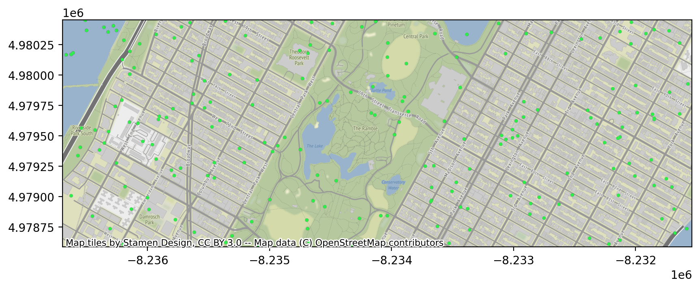
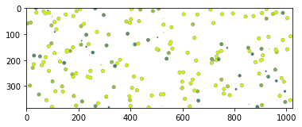
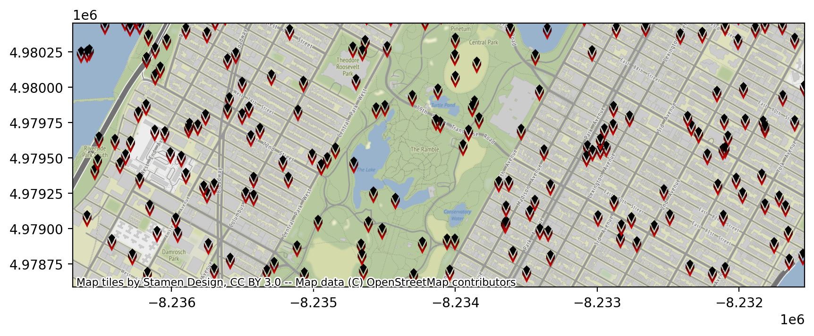

# Visualizing Spatiotemporal Information via Arctern

Arctern can draw multiple types of transparent layers and add a map background to these images. This article shows how to use Arctern to visualizing spatiotemporal information.

## Generate simulation data

Use random data to generate a taxi trip record data, which will be used later to make various plots:

```python
import pandas as pd

def gen_data(num_rows, bbox):
    import random
    pickup_longitude = [(bbox[2]-bbox[0])*random.random()+bbox[0] for i in range(num_rows)]
    pickup_latitude = [(bbox[3]-bbox[1])*random.random()+bbox[1] for i in range(num_rows)]
    fare_amount = [100*random.random() for i in range(num_rows)]
    tip_amount = [fare*(random.random()*0.05+0.15) for fare in fare_amount]
    total_amount = [fare_amount[i]+tip_amount[i] for i in range(num_rows)]
    return pd.DataFrame({"pickup_longitude":pickup_longitude,
                         "pickup_latitude":pickup_latitude,
                         "fare_amount":fare_amount,
                         "total_amount":total_amount})
num_rows=200
bbox=[-73.991504, 40.770759, -73.945155, 40.783434]
df=gen_data(num_rows,bbox)
df
```

In the geographic area with a longitude range of -73.991504 ~ -73.945155 and a latitude range of 40.770759 ~ 40.783434, the above code randomly extracts 200 coordinate points as pickup locations and generates random taxi fares accordingly. The description of the taxi trip record data is as follows:

| Name             | Description                                                  | Type   |
| :--------------- | :----------------------------------------------------------- | :----- |
| pickup_longitude | Longitude coordinate of where the taxi ride started          | double |
| pickup_latitude  | Latitude coordinate of where the taxi ride started.          | double |
| fare_amount      | Dollar amount of the cost of the taxi ride without any tip.  | double |
| total_amount     | Total dollar amount of the cost of the taxi ride including the tip. | double |

## Installing dependent libraries

```bash
conda install -c conda-forge matplotlib
conda install -c conda-forge contextily
conda install -c conda-forge pyproj
```

## Import plot modules

Import the following libraries:

* **arctern:** Provides modules for drawing and saving geographic information layers.
* **matplotlib:** Provides modules for drawing pictures in Juypter Notebook.

```python
import arctern
from arctern.util import save_png, vega
import matplotlib.pyplot as plt
import matplotlib.image as mpimg
```

## Point map

### Transparent point map

Use the `vega_pointmap` and` point_map_layer` functions of Arctern to draw a point map based on the taxi trip record data. For each point, its position is defined by the pickup location, its size is 10, its color is # 2DEF4A, and its opacity is 1.

```python
point_vega = vega.vega_pointmap(1024, 
                                384, 
                                bounding_box=bbox, 
                                point_size=10, 
                                point_color="#2DEF4A", 
                                opacity=1, 
                                coordinate_system="EPSG:4326")
png = arctern.point_map_layer(point_vega, 
                              arctern.ST_Point(df.pickup_longitude,df.pickup_latitude))
save_png(png, '/tmp/arctern_pointmap.png')
plt.imshow(mpimg.imread("/tmp/arctern_pointmap.png"))
```


### Overlaying a map background with a point map

Use the `plot_pointmap` function of Arctern to draw a point map with a map background based on the taxi trip record data. For each point, its position is defined by the pickup location, its size is 10, its color is # 2DEF4A, and its opacity is 1.

```python
fig, ax = plt.subplots(figsize=(10, 6), dpi=200)
arctern.plot_pointmap(ax, 
                      arctern.ST_Point(df.pickup_longitude,df.pickup_latitude),
                      bbox,
                      point_size=10,
                      point_color="#2DEF4A",
                      opacity=1,
                      coordinate_system="EPSG:4326")
```



## Weighted point map

### Transparent weighted point map

Use the `vega_weighted_pointmap` and `weighted_point_map_layer` functions of Arctern to draw a weighted point map based on the taxi trip record data. For each point, its position is defined by the pickup location, its color varies between # 115f9a ~ # d0f400 according to the taxi trip fare (`df.fare_amount`), its size varies between 5 ~ 30 according to the total taxi fare (` df.total_amount`), its opacity is 1.

```python
color_bound=[df.fare_amount.min(), df.fare_amount.max()]

size_bound=[5, 30]
total_max=df.total_amount.max()
total_min=df.total_amount.min()
size_weights = [(v-total_min)/(total_max-total_min)*(size_bound[1]-size_bound[0])+size_bound[0] for v in df.total_amount]
size_weights = pd.Series(size_weights)

point_vega = vega.vega_weighted_pointmap(1024, 
                                    384, 
                                    bounding_box=bbox, 
                                    color_gradient=["#115f9a", "#d0f400"], 
                                    color_bound=color_bound,
                                    size_bound=size_bound,
                                    opacity=1.0, 
                                    coordinate_system="EPSG:4326")
png = arctern.weighted_point_map_layer(point_vega, 
                                       arctern.ST_Point(df.pickup_longitude,df.pickup_latitude),
                                       color_weights=df.fare_amount,
                                       size_weights=size_weights)
save_png(png, "/tmp/arctern_weighted_pointmap.png")
plt.imshow(mpimg.imread("/tmp/arctern_weighted_pointmap.png"))
```



### Overlaying a map background with a weighted point map

Use the `plot_weighted_pointmap` function of Arctern to draw a weighted point map with a map background based on the taxi trip record data. For each point, its position is defined by the pickup location, its color varies between # 115f9a ~ # d0f400 according to the taxi trip fare (`df.fare_amount`), its size varies between 5 ~ 30 according to the total taxi fare (` df.total_amount`), its opacity is 1.

```python
color_bound=[df.fare_amount.min(), df.fare_amount.max()]

size_bound=[5, 30]
total_max=df.total_amount.max()
total_min=df.total_amount.min()
size_weights = [(v-total_min)/(total_max-total_min)*(size_bound[1]-size_bound[0])+size_bound[0] for v in df.total_amount]
size_weights = pd.Series(size_weights)

fig, ax = plt.subplots(figsize=(10, 6), dpi=200)
arctern.plot_weighted_pointmap(ax, 
                       arctern.ST_Point(df.pickup_longitude,df.pickup_latitude), 
                       color_weights=df.fare_amount,
                       size_weights=size_weights,
                       bounding_box=bbox, 
                       color_gradient=["#115f9a", "#d0f400"], 
                       color_bound=color_bound, 
                       size_bound=size_bound, 
                       opacity=1.0, 
                       coordinate_system="EPSG:4326")
```


## Heat map

### Transparent heat map

Use the `vega_heatmap` and `heat_map_layer` functions of Arctern to draw a heatmap based on the taxi trip record data. The color of each position is decided by the total taxi fare (` df.total_amount`).

```python
head_vega = vega.vega_heatmap(1024, 
                              384, 
                              bounding_box=bbox, 
                              map_zoom_level=13.0, 
                              coordinate_system="EPSG:4326")
png = arctern.heat_map_layer(head_vega, 
                     arctern.ST_Point(df.pickup_longitude,df.pickup_latitude), 
                     df.fare_amount)
save_png(png, "/tmp/arctern_heatmap.png")
plt.imshow(mpimg.imread("/tmp/arctern_heatmap.png"))
```


### Overlaying a map background with a heat map

Use the `plot_heatmap` function of Arctern to draw a heat map with a map background based on the taxi trip record data. The color of each position is decided by the total taxi fare (` df.total_amount`).

```python
fig, ax = plt.subplots(figsize=(10, 6), dpi=200)
arctern.plot_heatmap(ax, 
                     arctern.ST_Point(df.pickup_longitude,df.pickup_latitude), 
                     df.fare_amount, 
                     bbox, 
                     coordinate_system="EPSG:4326")
```


## Choropleth map

The choropleth map can draw a large number of building outlines within a geographical area. In order to simply demonstrate how to draw construction contours, we only create two POLYGON objects `p1` and` p2` to describe the outlines of two buildings.

```python
p1="POLYGON ((-73.9559920952719 40.7798302112586,-73.9558373836227 40.780041920447,-73.955817052153 40.7800697417696,-73.9561541507251 40.7802120850128,-73.9560310179165 40.780380581462,-73.9559809829928 40.7804490491413,-73.9554245436102 40.780214085171,-73.9552722050953 40.7801497573115,-73.9554553121101 40.7798991968954,-73.9556088484124 40.7796890996611,-73.955620419799 40.7796732651862,-73.9559015149432 40.7797919620232,-73.9559920952719 40.7798302112586))"
p2="POLYGON ((-73.9542329907899 40.7787670145087,-73.9545101860555 40.7783876598084,-73.9546846384315 40.778461320293,-73.9548206058685 40.7785187302746,-73.9549036921298 40.7785538112695,-73.9550251774329 40.7786051054324,-73.9550562469185 40.7786182243649,-73.9549683394669 40.7787385313679,-73.9547798956672 40.778996428053,-73.954779053804 40.7789975803655,-73.9545166590009 40.7788867891633,-73.9544446005066 40.7788563633454,-73.9542329907899 40.7787670145087))"
```

### Transparent choropleth map

Use the `vega_choroplethmap` and `choropleth_map_layer` functions of Arctern to draw a choropleth map based on the description of two building outlines `p1` and `p2`.

```python
choropleth_vega = vega.vega_choroplethmap(1024, 
                                          384, 
                                          bounding_box=bbox, 
                                          color_gradient=["#115f9a", "#d0f400"], 
                                          color_bound=[2.5, 5], 
                                          opacity=1.0, 
                                          coordinate_system="EPSG:4326")
png = arctern.choropleth_map_layer(choropleth_vega, 
                                   arctern.ST_GeomFromText(pd.Series([p1,p2])),
                                   pd.Series([50,50]))
save_png(png, "/tmp/arctern_choroplethmap.png")
plt.imshow(mpimg.imread("/tmp/arctern_choroplethmap.png"))
```


### Overlaying a map background with a choropleth map

Use the `plot_choroplethmap` function of Arctern to draw a choropleth map with a map background based on the description of two building outlines `p1` and `p2`.

```python
fig, ax = plt.subplots(figsize=(10, 6), dpi=200)
arctern.plot_choroplethmap(ax, 
                           arctern.ST_GeomFromText(pd.Series([p1,p2])),
                           pd.Series([50,50]),
                           bbox, 
                           color_gradient=["#115f9a", "#d0f400"], 
                           color_bound=[2.5, 5], 
                           opacity=1.0, 
                           coordinate_system="EPSG:4326")
```


## Icon map

Download an icon image that will be used later to draw icon maps:

```bash
wget https://raw.githubusercontent.com/zilliztech/arctern-docs/master/img/icon/arctern-icon-small.png -o /tmp/arctern-logo.png
```

### Transparent icon map

Use the `vega_icon` and `icon_viz_layer` functions of Arctern to draw an icon map based on the taxi trip record data. The position of each icon is defined by the pickup location.

```python
icon_vega = vega.vega_icon(1024, 
                           384, 
                           bounding_box=bbox, 
                           icon_path="/tmp/arctern-logo.png", 
                           coordinate_system="EPSG:4326")
png = arctern.icon_viz_layer(icon_vega,
                             arctern.ST_Point(df.pickup_longitude,df.pickup_latitude))
save_png(png, "/tmp/arctern_iconviz.png")
plt.imshow(mpimg.imread("/tmp/arctern_iconviz.png"))
```


### Overlaying a map background with a icon map

Use the `plot_iconviz` function of Arctern to draw an icon map based on the taxi trip record data. The position of each icon is defined by the pickup location.

```python
fig, ax = plt.subplots(figsize=(10, 6), dpi=200)
arctern.plot_iconviz(ax, 
                     arctern.ST_Point(df.pickup_longitude,df.pickup_latitude),  
                     icon_path="/tmp/arctern-logo.png", 
                     bounding_box=bbox,
                     coordinate_system="EPSG:4326")
```



## Fishnet map

### Transparent fishnet map

Use the `vega_fishnetmap` and `fishnet_map_layer` functions of Arctern to draw a fishnet map based on the taxi trip record data. The position of each point is defined by the pickup location.

```python
fish_vega = vega.vega_fishnetmap(1024, 
                                 384, 
                                 bounding_box=bbox, 
                                 cell_size=8, 
                                 cell_spacing=1, 
                                 opacity=1.0, 
                                 coordinate_system="EPSG:4326")
png = arctern.fishnet_map_layer(fish_vega,
                                arctern.ST_Point(df.pickup_longitude,df.pickup_latitude), 
                                df.fare_amount)
save_png(png, "/tmp/arctern_fishnetmap.png")
plt.imshow(mpimg.imread("/tmp/arctern_fishnetmap.png"))
```


### Overlaying a map background with a fishnet map

Use the `plot_fishnetmap` function of Arctern to draw a fishnet map based on the taxi trip record data. The position of each icon is defined by the pickup location.

```python
fig, ax = plt.subplots(figsize=(10, 6), dpi=200)
arctern.plot_fishnetmap(ax, 
                        arctern.ST_Point(df.pickup_longitude,df.pickup_latitude), 
                        df.fare_amount, 
                        bbox, 
                        cell_size=8, 
                        cell_spacing=1, 
                        opacity=1.0, 
                        coordinate_system="EPSG:4326")
```

