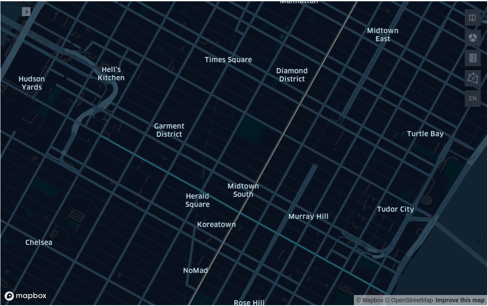
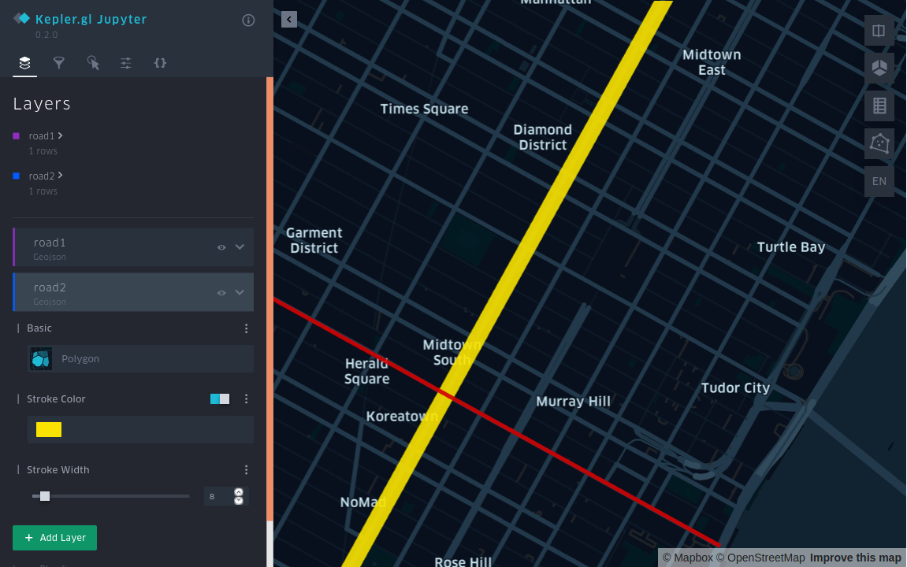
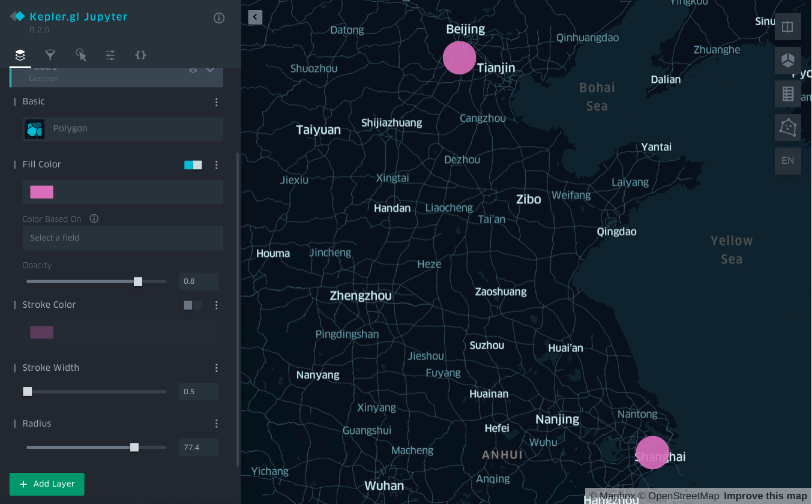

# Use Arctern to analyze spatial data

After completing the [installation and deployment of Arctern](./standalone_installation.md), let's have a try at Arctern through analyzing the road information near the Empire State Building.

### Install Jupyter and Kepler.gl

In the next sections, you need to use Jupyter Notebook for running Python codes and Kepler.gl for visualizing spatial data. Follow the steps below to install Jupyter and Kepler.gl:

Enter the Conda environment:

```bash
$ conda activate arctern_env
```

Install Jupyter and Kepler.gl:

```bash
$ conda install -c conda-forge jupyterlab
$ pip install keplergl
```

## Run Jupyter Notebook

Run Jupyter Notebook in the Conda environment, and it opens a page in your default browser.

```bash
$ jupyter-notebook
```

Click **New &gt; Python3** at the top right corner of the page to create a new notebook.

## Run Arctern

### Use Arctern to analyze road information

> **Note:** Run the following operations in a new Notebook.

Import `arctern`, `keplergl` and other related libraries:

```python
>>> from keplergl import KeplerGl
>>> import pandas as pd
>>> import arctern
```

Create two LINESTRING objects (`road1`, `road2`) in WKT format based on the two roads near the Empire State Building:

```python
>>> # The latitude and longitude coordinates of the two ends of road1 are (-73.996324, 40.753388) and (-73.972088, 40.743215).
>>> # The latitude and longitude coordinates of the two ends of road2 are (-73.989555, 40.741531) and (-73.973952, 40.762962).
>>> road1 = 'LINESTRING (-73.996324 40.753388, -73.972088 40.743215)'
>>> road2 = 'LINESTRING (-73.989555 40.741531, -73.973952 40.762962)'
```

Use `GeoSeries.intersects` to check whether `road1` and `road2` intersect.

* _True:_ the two roads intersect.
* _False:_ the two roads do not intersect.

```python
>>> geo1 = arctern.GeoSeries(road1)
>>> geo2 = arctern.GeoSeries(road2)
>>> geo1.intersects(geo2)
0    True
dtype: bool
```

### Use Kepler.gl to create a map

Use Kepler.gl to plot `road1` and `road2` on a map, and check if the two roads intersect:

```python
>>> KeplerGl(height=600,data={"road1": pd.DataFrame(data={"road1":[road1]}),
                          "road2": pd.DataFrame(data={"raod2":[road2]})})
```



You can also click **&gt;** at the top right corner of the Kepler.gl interface to expand the sidebar and change the color and line width of each road.



### Use Arctern to filter data

> **Note:** Run the following operations in a new Notebook.

Import `arctern`, `keplergl` and other related libraries:

```python
>>> from keplergl import KeplerGl
>>> import pandas as pd
>>> from arctern import GeoDataFrame
```

Create a GeoDataFrame object `df` to represent the city information:

```python
>>> data = {
>>>     'City': ['BeiJing', 'ShangHai', 'Tokyo', 'Seoul'],
>>>     'Country': ['China', 'China', 'Japan', 'Korea'],
>>>     'Coordinates': ['POINT(116.24 39.55)', 'POINT(121.29 31.14)', 
>>>                     'POINT(139.49 35.40)', 'POINT(126.58 37.33)']
>>> }
>>> df = GeoDataFrame(data, geometries=["Coordinates"], crs="EPSG:4326")
```

Filter the city information that satisfies `Country == "China"`:

```python
>>> in_china = pd.Series([df.Country[idx] == "China" for idx in range (0, len(df))])
>>> df_in_china = df[in_china]
>>> df_in_china
	City	Country	Coordinates
0	BeiJing	China	POINT (116.24 39.55)
1	ShangHai	China	POINT (121.29 31.14)
```

### Use Kepler.gl to create a map

Use Kepler.Gl to mark the two cities `Beijing` and 　`ShangHai` on the map:

```python
>>> KeplerGl(height=600, data={"citys":pd.DataFrame(rst.Coordinates.to_wkt())})
```

